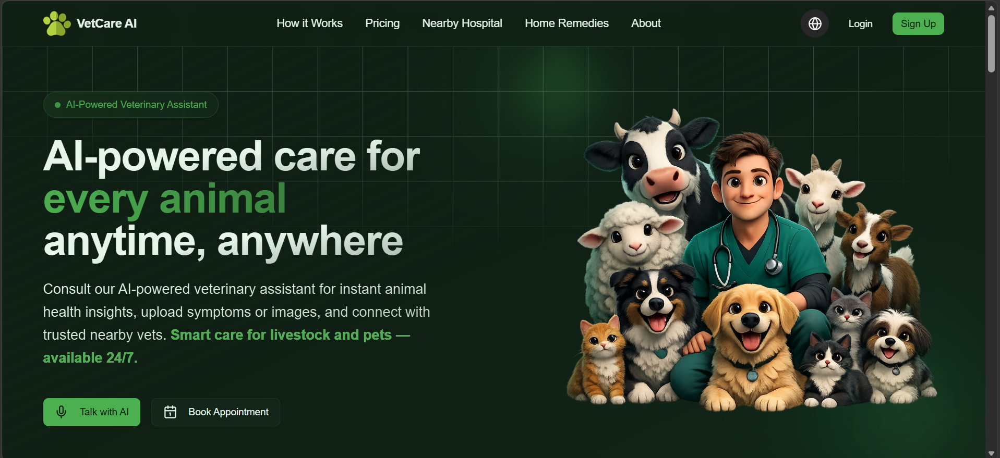

<div align="center">

# 🐾 VetCare AI

### Intelligent Veterinary Healthcare Platform Powered by Artificial Intelligence

<p align="center">
  
</p>

<p align="center">

<a href="https://vet-care-ai.vercel.app/">
  
</a>

<a href="https://github.com/YOUR_USERNAME/VetCareAI">
  
</a>

<a href="https://github.com/YOUR_USERNAME/VetCareAI/network/members">
  
</a>

</p>

<p align="center">


</p>

</div>

---

## 📸 Product Preview

<div align="center">

</div>

---

## 🌍 Live Platform

### 🔗 https://vet-care-ai.vercel.app/

---

# Problem

Millions of pet owners and livestock farmers lack immediate access to veterinary expertise, especially in rural and underserved regions.

Delayed diagnosis often leads to:

- Increased treatment costs
- Disease progression
- Livestock productivity loss
- Reduced animal welfare

---

# Solution

VetCare AI leverages Artificial Intelligence to provide instant preliminary disease analysis from animal images and symptoms while connecting users with veterinary professionals through a modern digital healthcare ecosystem.

---

# Core Features

### 🧠 AI Disease Detection

Analyze animal images using AI to identify potential diseases and health conditions.

### 📷 Image-Based Diagnosis

Upload animal photos and receive intelligent health assessments within seconds.

### 💊 Treatment Recommendations

Generate AI-assisted treatment guidance and recovery recommendations.

### 🥗 Personalized Diet Suggestions

Nutrition plans tailored to disease conditions and recovery stages.

### 🩺 Veterinary Discovery

Locate nearby veterinarians, clinics, and hospitals.

### 📅 Appointment Management

Book, manage, and track veterinary consultations.

### 🔐 Secure Authentication

Enterprise-grade authentication powered by Clerk.

---

# Technology Stack

| Layer | Technologies |
|---------|-------------|
| Frontend | Next.js 16, React, TypeScript |
| Styling | Tailwind CSS |
| Authentication | Clerk |
| Database | PostgreSQL (Neon) |
| ORM | Prisma |
| Hosting | Vercel |
| AI Layer | Gemini API |

---

# Architecture

```text
Client
  │
  ▼
Next.js Frontend
  │
  ▼
Clerk Authentication
  │
  ▼
API Layer
  │
  ├── Disease Analysis
  ├── Treatment Engine
  ├── Diet Recommendation
  └── Appointment System
  │
  ▼
Prisma ORM
  │
  ▼
Neon PostgreSQL
```

# Quick Start

```bash
git clone https://github.com/YOUR_USERNAME/VetCareAI.git

cd VetCareAI

npm install

npm run dev
```

Visit:

```bash
http://localhost:3000
```

# Roadmap

- [x] Authentication
- [x] Disease Detection
- [x] Appointment Booking
- [x] Treatment Suggestions
- [ ] Multi-language Support
- [ ] Mobile Application
- [ ] Video-Based Diagnosis
- [ ] Emergency Consultation

# Developer

## Abhay Kumar Yadav

B.Tech Information Technology

Passionate about AI, Full-Stack Development, and Building Technology that Solves Real-World Problems.

### Connect

- LinkedIn
- Portfolio
- GitHub

---

<div align="center">

### 🚀 Reimagining Animal Healthcare Through Artificial Intelligence

⭐ Star this repository if you found it useful.

</div>
